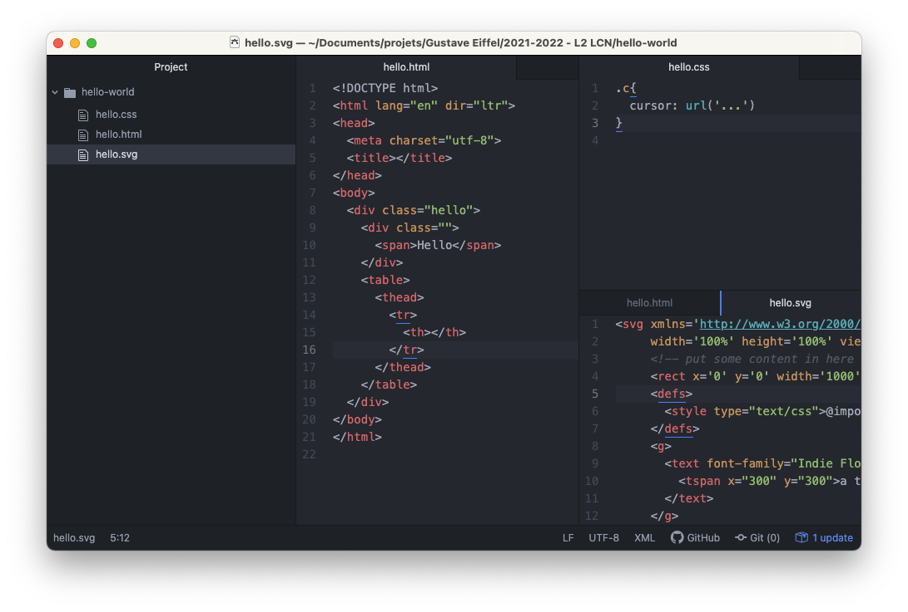
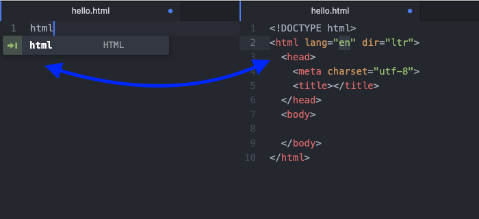
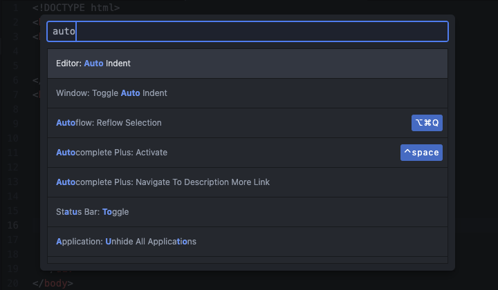
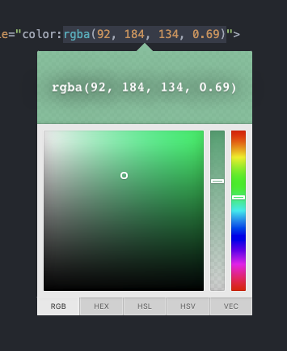

Atom vous simplifie la saisie du code, 
à travers de nombreux petits détails et fonctionnalités que vous découvrirez. 

## Tabulation et indentation

**L'indentation** est essentielle pour conserver un code **lisible**. Elle reflette la structure, l'arborescence du document HTML. 

Il est possible de **décaler** l'indentation **vers la droite** en selectionnant une partie du code, et en appuyant sur la touche `TAB` (*tabulation*). 

Inversement,  on peut décaler **vers la gauche** avec la combinaison `SHIFT`  (Maj.) + `TAB`.

Atom a aussi une fonction pour faire de l'**indentation automatique** : 
à partir d'une selection, depuis le menu > **Edit** > **Lines** > **Auto Indent**.  

## Onglets

Atom permet de diviser la fenêtre en plusieurs onglets. Chaque onglet peut lui-même se subdiviser en partie, **verticalement** et **horizontalement**, dans toutes les directions ! Pour cela, il faut utiliser les fonctions de **split**.

- split left ← 
- split right → 
- split up ↑
- split down ↓

Une barre d'onglet peut accueillir plusieurs fichiers, qu'on peut déplacer en glisser-déposer (drag & drop.)

## Autocompletion et zen-coding

Dans un document, vous commencez à taper les premiers caractère de la balise
— avec ou sans le signe `<` — et Atom vous propose une liste que vous pouvez
parcourir au clavier avec les touches `↑` et `↓` de votre clavier. 
Une fois votre selection faite, vous pouvez la valider avec la touche `TAB` (*tabulation*)

Ci-dessus, on observe que si on le fait avec la balise `html`, Atom nous génère le code minimum pour un document HTML, c'est pratique !

## La palette de commande

Un outil pour accéder à la palette avec le raccourci clavier `CTRL` + `MAJ` +  `P` (sur Windows)

Cette palette permet d'accéder aux fonction d'Atom sans passer par le menu, et donc de gagner du temps ! Il suffit de rechercher l'action que l'on veut faire : par exemple si je veux faire de l'indentation automatique, j'ouvre la palette, et je cherche « auto indent » puis je valide avec la touche `ENTER` 

## Trouver un fichier

Ce raccourci est pratique quand on commence à avoir beaucoup de fichier dans sont projet. Il ressemble à celui de la palette avec le raccourci clavier, simplement : `CTRL` + `P` (sur Windows)

Palette de couleur

## Ajout d'extension

Atom permet d'installer des **packages** supplémentaires, pour avoir plus de fonctionnalités, en fonction de vos envies et besoins. 

Pour cela, il faut aller dans les paramètres de l'application (menu **Settings**) l'onglet **Package** liste ceux qui sont déjà installés, l'onglet **Install** une bibliothèque, dans laquelle il est possible de faire une recherche.

On peut par exemple installer le package `color-picker` qui permet d'afficher une palette de selection de couleur avec le raccourci clavier `CTRL`+`MAJ`+`C` — **C** comme … Couleur !

