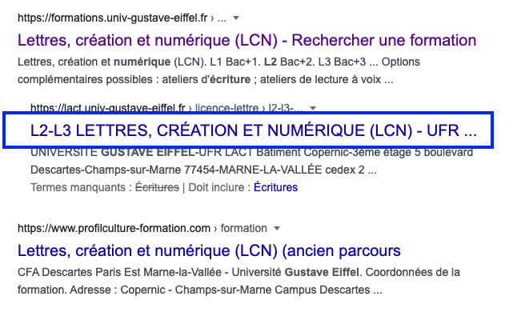

Comme vu au chapitre précédent, c’est la balise d’en-tête, qui contient les informations générales sur la page comme le titre, l’encodage, les meta. On y déclarera aussi des liaisons vers les feuilles de style CSS et les script JavaScript.

## Métadonnées du document

### Balise `<meta charset="utf-8" />`

C’est la balise d’**encodage** du texte, des caractères. L’encodage est une chose assez complexe, et sert à décrire les nombreuses variante d’écriture du monde sous forme numérique, et donc obligatoire.

Pour faire simple, utilisez l’encodage `utf-8`, il est la norme, car il couvre toutes les écritures du monde, alphabétiques et idéogrammatiques.

Cette balise `<meta />` est donc la première à insérer dans le head, car d’elle dépend tous le traitement du texte.

```html
<meta charset="utf-8" />
```

La norme `utf-8` est établie par **[Unicode](https://home.unicode.org/)**. **Unicode** est un système de codage créé en 1998, qui spécifie un nombre unique pour chaque caractère, quels que soient la plate-forme, le logiciel et la langue utilisés. **Unicode** est constitué de 137 929 caractères, et est compatible avec plus de 100 écritures différentes, grâce à ses jeux de caractères uniques.

### Balise `<title> … </title>`

c’est la balise de **titre**. Le titre d’un document HTML est très important, même si à la base, il est visiblement peu présent. le code suivant `<title>Mon exercice</title>`

s’affiche dans l’onglet ou le titre de la fenêtre. Il a une grande importance sémantique, puisque par exemple, c’est lui que **référence google**, ci-dessous en bleu souligné.



### Balise `<meta name="viewport" ...>`

La balise meta `viewport` permet de contrôler la mise en page, et elle est surtout prévu pour les écrans mobiles. Elle permet de ne pas afficher une *vue dézoomée* de la page sur ces appareils. 

La valeur que l'on utilise généralement, pour ne pas avoir de dézoom sur mobile est la suivante.

```html
<meta name="viewport" content="width=device-width, initial-scale=1">
```


## Lier des scripts et feuilles de styles au document

### Balise `<link>` pour attacher une feuille de style CSS

Quand on veut attacher une feuille de style `CSS` à la page HTML, on devra passer par cette balise et préciser le fichier .css que l’on veut utiliser

```html
<link href="styles/ma-feuille-de-styles.css" rel="stylesheet" />
```

Il est possible d’attacher autant de feuille de style que l’on veut par page.

Le fait de pouvoir séparer dans un fichier CSS les styles (*= la mise en forme*) du contenu (*= le sens*) permet de **mutualiser** les feuilles de style d’une page à une autre. Ainsi, pour un site web avec de multiples pages, on aura les mêmes feuilles de style CSS pour toutes les pages.

### Balise `<script>` pour attacher du javascript

Même si nous ne le verrons pas directement le language javascript ce semestre, la balise script permet d’attacher au document un script externe, qui sera exécuté. Les rôles de ses script `javascript` peuvent être très variés, plus ou moins complexes. Ils servent à faire par exemple, des interactions dynamiques, des modifications en direct du contenu de la page.

```html
<script src="js/mon-fichier.js" type="text/javascript"></script>
```

### Exemple de `<head>`

```html
<html lang="fr">
<head>
  <meta charset="utf-8" />
  <title>Mon exercice</title>
  <meta name="viewport" content="width=device-width, initial-scale=1">
  <link href="styles/ma-feuille-de-styles.css" rel="stylesheet" />
  <script src="js/mon-fichier.js" type="text/javascript"></script>
</head>
<body>
  ...
</body>
</html>
```