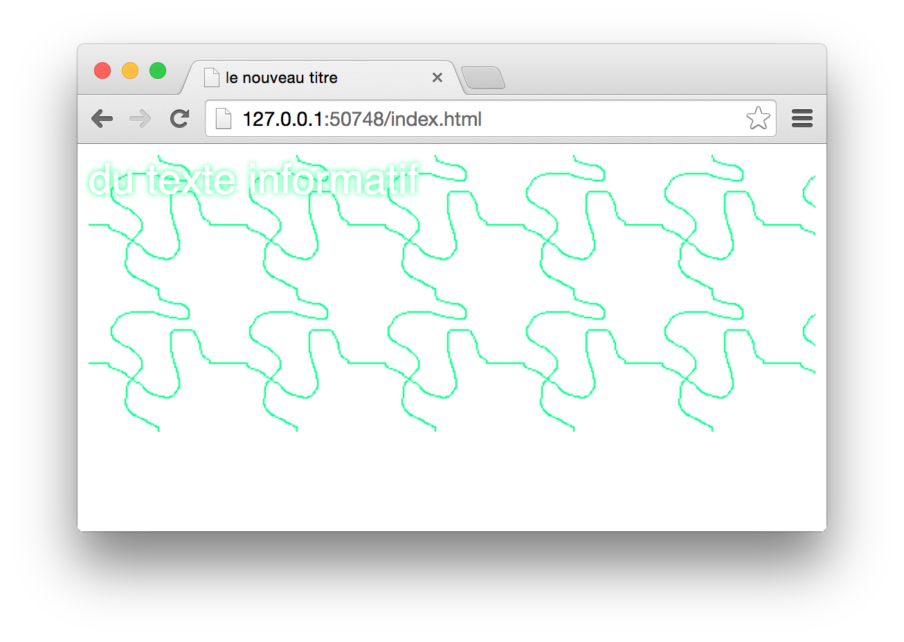

## Images

Il y a 2 manières de considérer les images dans une page web.

- L'image **fait partie du contenu** — pour sa valeur sémantique. C'est le cas par exemple d'une illustration pour un article, d'une photographie, etc. 
  Dans ce cas là, on gèrera l'image via HTML
- L'image **est décorative** — pour avoir une mise en page plus riche. C’est le cas par exemple pour ajouter une texture d'arrière-plan. 
  Dans ce cas là, on gèrera l'image via CSS. 

### Balise ``

Le moyen le plus simple d’ajouter une image dans la page est d’utiliser la balise `img`. 

C’est une **balise orpheline**, qui est à utiliser quand l'image **fait partie du contenu**. Par défaut, la balise  `img` est considérée comme *inline* — c'est à dire qu'elle va s'insérer *dans le texte*.

Elle possède deux attributs obligatoires `src` et `alt`. On doit saisir le chemin vers le fichier image dans l’attribut `src`.

```html

```

Dans les recommandations HTML5, l’attribut `alt` est obligatoire pour la balise `img`. Il sert à décrire l’image — pour les systèmes d’audio-description et les navigateurs sans image. On peut laisser une valeur vide à l'attribut — `alt=""` — si aucun texte n'a de sens pour l'image. 

On reconnait dans l’exemple que j’ai utilisé un **chemin** d’une image **dans un dossier**. Comme vu au dessus, je vous recommande de ranger toutes vos images dans un dossier. Dans la notation des **chemins de fichier**, on écrit la hiérarchie des dossiers en les séparant par des `/` (**slash**) 

```
mon_dossier/un_autre/encore_un/mon_fichier.jpg
```

On peut également ajouter une **URL distante** pour faire référence à une image hébergée sur un autre site web. 

```html

```

Ce qui donnera cette image, hébergée gracieusement par Wikimedia Commons.


La balise image peut elle même être sémantiquement intégrée à une balise `<figure>` pour ajouter plusieurs une légende textuelle visible, avec la balise `<figcaption>`. On procédera ainsi 

```html
<figure>
    
    <figcaption>Giants look at Gulliver through a magnifier.</figcaption>
</figure>
```

Une fois ajouté dans le code HTML, la balise `img` affiche l’image dans sa taille en pixels. Il est possible de forcer une taille pour cette image, en utilisant les attributs `width` (largeur) et `height` (hauteur). Par défaut, on exprime ces tailles en pixels.

```html

```

 On peut également modifier ce dimensionnement en css, avec les propriétés `width` et `height`, ou les contraindre avec des maximum ou minimum. Si on veut que la balise se comporte comme un block, il faut également utiliser la propriété `display:block`

```css
img{
  display:block; /* par défaut, les images se comporte comme du texte , display:inline */
	width:100%; /* force l'image à prendre toute la largeur */
	max-width:100%; /* empêche l'image de déborder de l'espace du bloc */
  min-width:100%; /* force l'image à occuper tout l'espace */
}
```

### Image responsive

Pour avoir une image optimisée quelque soit la dimension de l'écran de l'utilisateur, on peut utiliser plusieurs sources, dans différentes taille. Pour cela, on peut utiliser la balise `picture`, `source`et l'attribut `media`. On retrouvera également ces principes de *media query* en CSS pour appliquer différents styles suivant la dimension de l'écran.

```html
<figure>
  <picture>
    <source srcset="https://upload.wikimedia.org/wikipedia/commons/2/20/Giants_look_at_Gulliver.jpg"
            media="(min-width: 417px)" />
    
  </picture>
  <figcaption>Giants look at Gulliver through a magnifier.</figcaption>
</figure>
```

> ci-dessus, on affiche la petite image jusqu’à 417px de large, ensuite, on affiche une très grande image. 

### Image css, en arrière-plan : `background`

L’autre moyen d’afficher une image est de l’ajouter en arrière-plan d’un bloc HTML, d’une balise. Pour cela on utilise la propriété CSS `background` ou plus précisément `background-image`. Pour décrire le **chemin** vers l’image on doit l’entourer du mot-clé `url("")`.

```html
<div class="decor">
	du texte informatif
</div>
```

```css
.decor{
	background-image:url("images/pattern.png");
/* autres propiétés du bloc */
	width: 100%;
	height: 200px;
	font-size: 30px;
	color: #fff;
	font-family: sans-serif;
	text-shadow: #10ff87 0 0 5px;
}
```

On voit dans cet exemple que *le texte* vient *par dessus* l'image. 



On peut affecter la manière dont l'image occupe le bloc en CSS 

```css
.decor{
	background-image:url("images/pattern.png");
  background-position: top left; /* center, top, left, bottom, right, 25%, 100px, … */
  background-repeat: no-repeat; /* repeat, repeat-x, repeat-y */
  background-size: cover; /* contain, 100%, … */
  background-color: red; /* couleur affichée sous l'image */
}
```

### Image *matricielle* vs. image *vectorielle*


Une image **vectorielle** est redimensionnable sans perte de qualité, contrairement à une image **matricielle**. On parle également d'image *bitmap* ou pixelisée pour parler des images matricielles.

Pour éditer une image vectorielle, on peut utiliser Adobe Illustrator ou Inkscape (libre). 
L'avantage de ce format et sa légereté, et sa capacité à être agrandit. Il est cependant limité et ne peut être utilisé que pour des illustrations avec peu de nuances de couleurs, du texte, des graphiques.  

Pour éditer une image matricielle, on peut utiliser Adobe Photoshop, The Gimp (libre), MS Paint. Il est plus passe-partout, mais peut vite avoir un poids important — ça ralentit le temps d'affichage — et se dégrader en cas d'agrandissement. 

### Formats d'image

Les formats d'images sur le web, les plus standards sont : 

- **JPEG** — utilisé en **photographie**
- **PNG24** — utilisé pour des images de haute qualité, ou **avec de la transparence**
- **PNG8** — utilisé pour des images en **palette restreinte**
- **GIF** — utilisé pour faire de **l'animation**
- **SVG** — utilisé pour faire des illustrations **vectorielles** (un logo par exemple)

il existe un format nommé WEBP de meilleure compression, mais qui n'est pas standard.

## Insérer de l'audio

Pour insérer du son, de l'audio, on utilise la balise éponyme `<audio>` et l'attribut `src`. On peut les insérer dans une balise `<figure>`

```html
<figure>
    <figcaption>Part 1, Chapter 4 of Gulliver's Travels read aloud</figcaption>
    <audio
        controls
        src="https://upload.wikimedia.org/wikipedia/commons/c/c2/LibriVox_-_Gulliver%27s_Travels_1-01.ogg">
            Votre navigateur ne supporte pas la balise
            <code>audio</code>.
    </audio>
</figure>

```

On peut indiquer plusieurs sources, avec des balises enfants `<source>` d'une manière assez similaire aux images. Cela permet au navigateur de choisir son codec audio, car tous ne sont pas supportés : **ogg** est un format libre, [mais non supporté par Safari sur iOS](https://caniuse.com/?search=ogg).  Le format **mp3** est le plus connu, et le mieux supporté. 

La balise possède plusieurs attributs permettant de controller l'affichage et la lecture du son, voici les principaux : 

- **`autoplay`** pour lancer le son dès le chargement de la page
- **`controls`** pour afficher les boutons de lecture
- **`loop`** pour lire le son en boucle
- **`preload`** indique au navigateur de pré-charger le son

<figure>
    <figcaption>Part 1, Chapter 4 of Gulliver's Travels read aloud</figcaption>
    <audio
        controls
        src="https://upload.wikimedia.org/wikipedia/commons/c/c2/LibriVox_-_Gulliver%27s_Travels_1-01.ogg">
            Votre navigateur ne supporte pas la balise
            <code>audio</code>.
    </audio>
</figure>

## Insérer de la vidéo

Pour insérer de la vidéo, on utilise la balise éponyme `<video>` et l'attribut `src`. On peut l'insérer dans une balise `<figure>` comme pour l'audio et l'image. 

```html
<figure>
    <figcaption>Le Voyage de Gulliver à Lilliput et chez les géants</figcaption>
    <video
        controls
       src="https://upload.wikimedia.org/wikipedia/commons/2/2d/Le_Voyage_de_Gulliver_%281902%29.webm">
            Votre navigateur ne supporte pas la balise
            <code>video</code>.
    </video>
</figure>
```

<figure>
    <figcaption>Le Voyage de Gulliver à Lilliput et chez les géants</figcaption>
    <video
        controls
       src="https://upload.wikimedia.org/wikipedia/commons/2/2d/Le_Voyage_de_Gulliver_%281902%29.webm">
            Votre navigateur ne supporte pas la balise
            <code>video</code>.
    </video>
</figure>

Comme pour l'audio on peut indiquer plusieurs sources, avec des balises enfants `<source>`. 
Cela permet au navigateur de choisir son codec video, car tous ne sont pas supportés.
Les codecs mp4, ogv et webm sont les plus supportés. 

La balise possède plusieurs attributs permettant de controller l'affichage et la lecture de la vidéo, voici les principaux :

- **`autoplay`** pour lancer le son dès le chargement de la page
- **`controls`** pour afficher les boutons de lecture
- **`loop`** pour lire le son en boucle
- **`preload`** indique au navigateur de pré-charger le fichier
- **`width`** et **`height`** pour dimensionner la vidéo, de la même manière qu'une image
- **`muted`** pour mettre le son de la vidéo en muet
- **`playinline`** Un attribut booléen qui indique que la vidéo doit être jouée en incise, c'est-à-dire au sein de la zone de lecture de l'élément
- **`poster`** Une URL qui contient une vignette à afficher tant que la vidéo est en cours de téléchargement. Si cet attribut n'est pas utilisé, rien n'est affiché jusqu'à ce que la première image de la vidéo soit disponible, ensuite, c'est cette image qui est affichée comme vignette sur la vidéo
