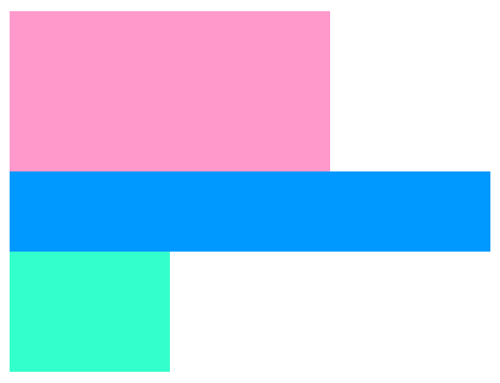
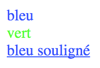

## Types de sélecteur

### Les sélecteurs d'élement

On l'a vu au chapitre précédent, ce type de sélecteur permet de dire à quel élément on applique le style.

```css
div{
	/* mes propriétés */
}

body{
	/* etc */
}

*{
  /* s'applique à toutes les balises */
}
```

>  NB : Il existe un selecteur magique pour dire *« n'importe quel élément »* : l'astérisque `*`.

### Les sélecteurs par identifiant : `#`

Les selecteurs d’élements ont une qualité … qui fait leur défaut : **il cible l’ensemble des balises du même nom**. On arrive vite à un problème quand on veut appliquer différents style à des balises de même nom (comme une balise `div`, par exemple, qui revient très souvent) On utilisera donc le **sélecteur par identifiant** (ou par **id**).

En CSS, on utilise le symbole `#` (**dieze**) pour comme **sélecteur d’identifiant**.

Voici un exemple d’utilisation d’**identifiant** sur 3 blocs.

```html
<div id="bloc-un"></div>

<div id="bloc-deux"></div>

<div id="bloc-trois"></div>
```

```css
#bloc-un{
	background:#ff99cc;
	width:200px;
	height:100px;
}

#bloc-deux{
	background:#0099ff;
	width:300px;
	height:50px;
}

#bloc-trois{
	background:#33ffcc;
	width:100px;
	height:75px;
}
```

Les trois selecteurs permettent ici de sélectionner les trois balises, qui ont un `attribut id` et d’appliquer des tailles et couleurs d’arrière-plan.



### Les sélecteurs par classe : `.`

Voici donc le sélecteur intermédiaire entre celui d’*élement* (trop global) et celui d’*identifiant* : le sélecteur de **classe**. Il sera souvent le plus recommandé, car il a une *priorité moyenne* dans les priorités css (nous y reviendrons).

En CSS, on utilise le symbole `.` (**point**) pour comme **sélecteur de classe**.

```html
<div class="bleu">bleu</div>

<div class="vert">vert</div>

<div class="bleu souligne">bleu souligné</div>
```

```css
.bleu{
	color: #3355ff;
}
.vert{
	color: #55ff33;
}
.souligne{
	text-decoration: underline;
}
```


Et voici le résultat :



On observe que contrairement à **l’attribut** `id` qui est unique, plusieurs **classes** peuvent être utilisées. On utilise **l’attribut** `class`, et si on veut utiliser plusieurs classes, on les **sépare par des espaces**.

### Sélecteur d'attribut

Plus occasionnel, ce sélecteur permet de cibler une balise par ces attributs, nom et/ou valeur. 

```css

input{
  /* tous les champs input */
  margin: 20px;

}

[type="checkbox"]{
  /* le champ de checkbox */
  background: #ffffbb;
}

[type="text"]{
  /* le champ texte */
  background: #ff66ff;
}
```

```html
<div>
<input name="ok" type="checkbox" />
Je vous apprends, me dit-il, 
qu’on a convoqué depuis peu 
plusieurs comités secrets à votre sujet…

<input name="le-sujet" type="text" />
</div> ```

### Et d’autres (pseudo-)sélecteurs…

Il existe d’autres types de sélecteurs, que l’on nomme **pseudo-sélecteur**. Certains permettent de décrire des positions dans la hiérarchie HTML, d’autres des états d‘interaction de la balise — comme le survol.

```css
div:hover{
	/* le survol sur une div la fait presque disparaitre ... */
	opacity: 0.2;
  color:#ff0000;
}

div:active{
  /* le clic la fait apparaître */
  opacity: 1;
  color:#0000ff;
}
```

```html
<div>Je vous apprends, me dit-il, qu’on a convoqué depuis peu plusieurs comités secrets à votre sujet, et que depuis deux jours sa majesté a pris une fâcheuse résolution.</div>

<div>Vous n’ignorez pas que Skyriesh Bolgolam (galbet ou grand-amiral) a presque toujours été votre ennemi mortel depuis votre arrivée ici. Je n’en sais pas l’origine ;</div>

<div>mais sa haine s’est fort augmentée depuis votre expédition contre la flotte de Blefuscu : comme amiral, il est jaloux de ce grand succès.</div>
```

Nous reviendrons plus tard sur ces nombreux pseudo-selecteurs, pseudo-classes et pseudo-éléments.

## Enchainement de sélecteurs

Bien que cette technique soit plus sophistiquée, elle mérite d'être aprise dès le début : les sélecteurs peuvent **s'enchainer pour cibler plus précisément les éléments,** et bénéficier de la hiérarchie — l'**arborescence** du document HTML. C'est aussi pour cela que l'on parle de Cascade. 

Là encore, l'exemple est éclairant : 

```html
<h3>Les Voyages de Gulliver : Voyage à Lilliput</h3>
<div class="bloc">
  <div class="en-tete">
		<h3>CHAPITRE VI.</h3>
		<div>Les mœurs des <b>habitants de Lilliput</b>, leur <b>littérature</b>, leurs lois, leurs coutumes et leur manière d’élever les enfans.</div>
  </div>
  <div class="corps">
    <p><span>Quoique</span><span>j’aie</span> <span>le dessein</span> de renvoyer la description de cet empire à un traité particulier, je crois cependant devoir en donner ici au lecteur quelque idée générale. Comme la taille ordinaire des gens du pays est un peu moins haute que de six pouces, il y a une proportion exacte dans tous les autres animaux, aussi bien que dans les plantes et dans les arbres. <b>Par exemple</b>, les chevaux et les bœufs les plus hauts sont de quatre à cinq pouces, les moutons d’un pouce et demi, plus ou moins, leurs oies environ de la grosseur d’un moineau ; en sorte que leurs insectes étaient presque invisibles pour moi ; mais la nature a su ajuster les <b>yeux</b> des habitans de Lilliput à tous les objets qui leur sont proportionnés. Pour faire connaître combien leur vue est perçante à l’égard des objets qui sont proches, je dirai que je vis une fois avec plaisir un cuisinier habile plumant une alouette qui n’était, pas si grosse qu’une mouche ordinaire, et une jeune fille enfilant une aiguille invisible avec de la soie pareillement invisible.
    </p>
    <p class="special">
      Ils ont des caractères et des lettres ; mais <b>leur façon d’écrire</b> est remarquable, n’étant ni de la gauche à la droite, comme celle de l’Europe ; ni de la droite à la gauche, comme celle des Arabes ; ni de haut en bas, comme celle des Chinois ; ni de bas en haut, comme celle des Cascaries ; mais obliquement et d’un angle du papier à l’autre, comme celle des dames d’Angleterre.
    </p>
  </div>
</div>
```

avec ce style

```css
p{
  font-size: 10px;
}
h3{
  font-size: 60px;
  line-height: 1em;
}
b{
  text-decoration: overline;
  color: purple;
}
.title, .bloc{
  font-family: "Helvetica", "Helvetica Neue", sans-serif;
  border: red 2px solid;
  width: 600px;
  max-width: 100%;
  margin: 50px 30px;
  padding: 20px;
}
.en-tete{
  line-height: 2em;
  margin: 2em 0;
}
.en-tete b{
  color: orange;
}
.bloc h3 {
		font-size: 30px;
    color: green;
}
.corps{
  line-height:1em;
}
.special{
  color:blue;
}
.special b{
  color:red;
}
div > div{
  background: lightgrey;
  padding: 5px
}
div > div > div{
  font-family: serif;
}
span{
  font-size:50px;
}
span + span{
  font-size:25px;
  font-style:italic;
}
span + span + span{
  font-size:17px;
}
```

Quelques usages, même si ils ne sont pas exhaustifs, les plus simples

- Le symbole virgule `,` permet d'enchainer plusieurs sélecteurs et d'appliquer les mêmes règles. 
- Les espaces ` ` permettent de décrire une hiérarchie parent ↔︎ enfant.
- Le symbole `>` permet de décrire également une hiérarchie parent ↔︎ enfant, mais directe, sans niveaux intermédiaire possible.
- Le symbole `+` permet de décrire des balises adjacentes.
