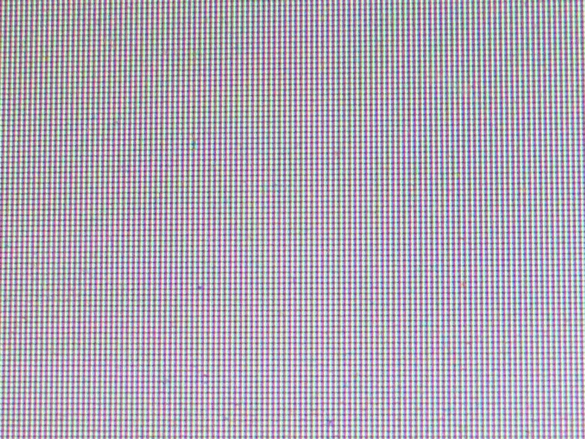
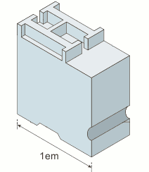
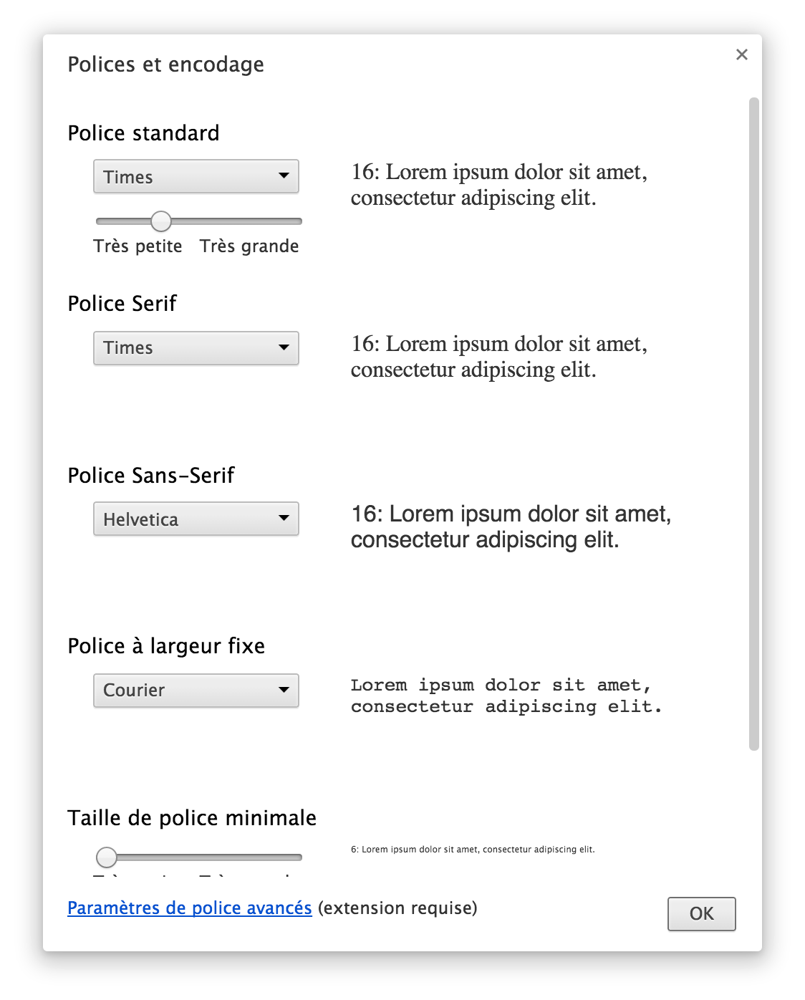
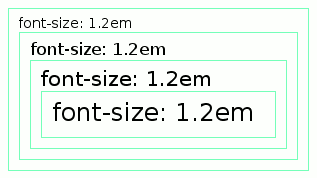

# Unités de mesure

La mise en page néscessite des unités. Nous allons voir que suivant les usages, on devra — *au sein d’un même document* — utiliser plusieurs unités différentes

## Unités

CSS offre différentes unités pour exprimer la longueur. Certaines ont une histoire en typographie, comme le **point** `pt` et le **pica** `pc`, d’autres sont connues pour leur usage quotidien, comme le **centimètre** `cm` et le **pouce** `in`. Et il y a également une unité propre aux écrans, le pixel `px`.

Ces unités sont des valeurs qui correspondent à des grandeurs physiques. On verra qu’il existe un autre type d’unité, **relatives**, comme le **pourcentage** `%`, les `em`, `ex` et `rem`.

D’une manière générale, on note les unités directement **après** la **valeur** numérique, **sans espace**. On utilisera le point `.` ~~et non la virgule~~ `,` pour les valeurs non entière. Quand la valeur est nulle on peut écrire `0` quelque soit son unité, même si `0` accepte aussi les unités.

```css
width: 130px;
font-size: 14.5em;
margin: 10px 0px 0 20px;
border-weight: 0;
left: -50px;
```

## Unités pour l’impression

CSS permet de gérer une mise en page pour l’impression d’une page web afin d’adapter celle-ci à une page A4 standard. Les unités utilisées alors sont les classiques de l’impression :

- le point `pt`
- le pica `pc`
- le millimètre `mm`
- le centimètre `cm`

Je ne rentre pas dans les détails de la mise en page CSS pour l’impression, mais pour déclarer un style pour l’impression, on utilise une **media queries** `@media print{}` :

```css
@media print{
	.selecteur{
		font-size:10pt;
	}
}
```

## L’unité de l’écran, le pixel `px`

Vous le connaissez certainement, le pixel est l’unité de vos écrans. Il correspond à l’unité même de ce que permet d’afficher un écran : une grille rectangulaire de points lumineux et colorés.



l’unité pixel respecte une logique entière, car on ne peut pas afficher un demi-pixel. Cependant certains logiciel vous permettent de mettre des valeurs à virgules. Ces valeurs sont donc possibles mais seront rendues en utilisant un lissage. d’une manière générale, je recommande pas d’utiliser des valeurs entière pour les pixels.

```css
.small{

	/* mauvais usage */
	font-size: 10.44px;

	/* bon usage */
	font-size: 10px;

}
```

### écran rétina, haute-définition

Aujourd’hui un nouveau type d’écran est venu révolutionner l’approche classique des pixels. Les écrans type `retina` sont en effet à des définitions 2 à 3 fois supérieures aux écrans traditionnels à 72dpi. Ces écrans — souvent mobiles — concervent la notion de pixel, mais en doublant ou triplant le nombre des pixels réels, suivant les écrans. Il n’y a donc pas à s’inquiéter pour ce type d’écran, même si ils ont plus de pixel, sauf au niveau de la définition des image, qui pourra sembler baver si on n’utilise pas d’image en définition x2. pour résoudre ce problème d’image en haute définition, la tendance veut qu’on vaforise des images vectorielles, au format `svg` qui garantiront une qualité à toutes les résolutions d’affichage.

## pourcentages `%`

On utilisera beaucoup les pourcentages, unité relative par excellence — on la note avec le symbole pourcentage `%`. Elle utilise le principe d’héritage par rapport à sa balise relative parente.

Suivant les cas, un bloc qui veut utiliser cette propriété doit être en `position: relative;` ou `position:absolute`.

On l’utilise beaucoup pour faire des largeurs de blocs qui s’adaptent à la taille de l’écran

```css
.demi{
    width:50%;
    border:solid 1px #000;
    min-height: 20px;
    margin:1px;
}
```

avec le code HTML suivant

```html
<div class="demi">
	<div class="demi">
		<div class="demi">
			<div class="demi">
	      <div class="demi">
	        <div class="demi"></div>
	      </div>
	    </div>
    </div>
  </div>
</div>
```


## em, unité typographique relative



l’unité `em` et une unité de mesure qui prend sa base dans la typographie : c’est le cadratin, la hauteur d’un plomb.

Sur le web, il n’y a pas de plomb, mais cette unité correspond à la hauteur relative du caractère. Par défaut, c’est celui de la configuration de votre navigateur, en général donc `1em = 16px`.

Si on change ses préférences, l’unité `em` sera proportionnelle à cette valeur configuré par l’utilisateur. Certains utilisateurs modifie celle-ci car ils ont des problèmes de vision. L’unité `em `est donc une unité utile pour l’accessibilité.



### héritage relatif

L’unité `em` est relative. Dans un document où les balises sont en cascade, cela signifie que le em est multiplicateur.

```css
.taille-en-em{
	font-size:1.2em;
}
```

```html
<div class="taille-en-em">
font-size:1.2em;
	<div class="taille-en-em">
        font-size:1.2em;
	            <div class="taille-en-em">
	            font-size:1.2em;
		                <div class="taille-en-em">
		                font-size:1.2em;
			                    <div class="taille-en-em">
			                    font-size:1.2em;
                                </div>
                        </div>
                </div>
	</div>
</div>
```



Pour plus d’information vous pouvez lire [cet excellent article sur l’unité em](http://www.alsacreations.com/article/lire/563-gerer-la-taille-du-texte-avec-les-em.html)

## Recommandation d’usage par unité.

|            |        Recommandé         |   Usage occasionnel   |   Non recommandé   |
| :--------: | :-----------------------: | :-------------------: | :----------------: |
|   Écran    |         em, px, %         |          ex           | pt, cm, mm, in, pc |
| Imprimante | em, cm, mm, in, pt, pc, % |        px, ex         |                    |

