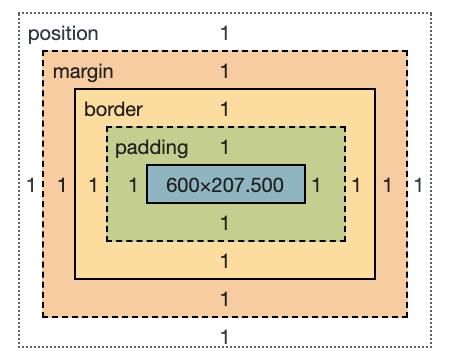

# Modèle de boîte 



En CSS, tout élément est inclus dans une boîte ("*box*" en anglais). Comprendre le fonctionnement de ces boîtes est essentiel pour maîtriser la mise en page CSS ainsi que le positionement des éléments d'une page HTML. Dans cette leçon, nous verrons en détails le *Modèle de Boîtes CSS* - son fonctionnement ainsi que sa terminologie - pour vous permettre de réaliser des mises en pages plus complexes.

## Les boîtes en ligne et boîte de bloc

En CSS, il existe deux type de boîtes : les boîtes **en bloc** ("*block boxes*" en anglais) et les boîtes **en ligne** (*"inline boxes"* en anglais ou également « boîtes en incise » en français). Ces deux qualifications renvoient au comportement de la boîte au sein de la page et vis-à-vis des autres boîtes :

Si une boîte est définie en bloc, elle suivra alors les règles suivantes :

- La boîte s'étend en largeur pour remplir totalement l'espace offert par son conteneur. Dans la plupart des cas, la boîte devient alors aussi large que son conteneur, occupant 100% de l'espace disponible.
- La boîte occupe sa propre nouvelle ligne et crée un retour à la ligne, faisant ainsi passer les éléments suivants à la ligne d'après.
- Les propriétés de **largeur** (`width`) et de **hauteur** (`height`) sont toujours respectées.
- Les propriétés `padding`, `margin` et `border` — correspondantes respectivement aux **écarts** de *padding* , à la **marge** et à la **bordure** de la boîte — auront pour effet de repousser les autres éléments.

À moins que l'on ne décide de changer le type de positionnement de la boîte en "en ligne", certains éléments tels que les titres (`<h1>`,`<h2>`, etc.) et les paragraphes (`<p>`) utilisent le mode "bloc" comme propriété de positionnement extérieur par défaut.

Si une boîte est positionnée en ligne, alors :

- La boîte ne crée pas de retour à la ligne, les autres éléments se suivent donc en ligne.
- Les propriétés de largeur (`width`) et de hauteur (`height`) ne s'appliquent pas.
- Le *padding* , les marges et les bordures verticales (en haut et en bas) seront appliquées mais ne provoqueront pas de déplacement des éléments alentours.
- Le *padding* , les marges et les bordures horizontales (à gauche et à droite) seront appliquées et provoqueront le déplacement des éléments alentours.

Les éléments `<a>`, utilisés pour les liens, ou encore `<span>`, `<em>` et `<strong>` sont tous des éléments qui s'affichent "en ligne" par défaut.

Le type de boîte appliqué à un élément est défini par la valeur de la propriété `display` tel que `block` ou `inline`, et se réfère à la valeur extérieure de positionnement (ou "*display*" en anglais).

Un dernier type de positionnement est le `flexbox` (utilisable avec la propriété CSS `display:flex`).

Beaucoup d'élement HTML **ont des propriétés par défaut au niveau du modèle de boîte**, 
certaines on des marges, des bordures, etc. C'est le cas des paragraphes, des titres, des listes, des boutons…


```html
<nav>
  <ul>
    <li><a href="onglet-1.html">Onglet 1</a></li>
    <li><a href="onglet-2.html">Onglet 2</a></li>
    <li><a href="onglet-3.html">Onglet 3</a></li>
  </ul>
</nav>
<main>
  <article>
    <p>
      Voici un début de texte. 
      les paragraphes se comportent en <code>block</code>
      <span>et ceci est une balise span, avec une <em>boîte en ligne</em> (<code>inline</code>) et donc n'a pas de padding </span>.
    </p>
    <p class="avec-padding">Les bordures permettent de bien voir les limites des blocs. surtout quand on rajoute du padding (marge intérieure.) </p>
    <p class="avec-padding avec-border-box">La propriété <br/><code>box-sizing:border-box</code> 
    permet de conptabiliser les bordures et marges intérieures dans le calcul des dimensions de la boîte, et par exemple appliquer une largeur, avec <br/><code>max-width:200px;</code>
    </p>
  </article>
</main>
```

```css
body{
  /* je recommande de mettre les marges du document à 0 */
  margin:0;
  padding:0;
  font-family: sans-serif;
}
nav{
  /* block */
  background: #f66;
  border: 2px solid #f33;
  padding: 20px;
  box-shadow: 0 0 50px #ff2222 inset;
}
nav ul{
  display:flex;
  padding: 0;
  margin:0;
}
ul{
  padding:0; 
  /* les listes, comme beaucoup de balises HTML on des marges par défaut */
  list-style:none; /* retire les points devant les listes*/
}
li{
  margin-right: 20px;
}
nav a{
  border:solid 1px #fff;
  border-radius: 6px;
  padding: 5px;
  box-shadow: 0 0 20px #ffffff ;
  display:block;
  text-decoration:none;
  color: #fff;
}
nav a:hover{
  background: #911;
}
main article{
  padding:20px;
}
p{
  max-width:200px;
  width:100%;
  border: solid 1px #000;
  margin: 0 0 30px 0;
}
span{
  background:rgba(100,100,255,.5);
  color:#fff;
  margin: 10px;
  padding: 2px;
}
code{
  background:#000;
  color:pink;
}
em{
  color:pink;
}
.avec-padding{
  padding: 1em;
}
.avec-border-box{
  box-sizing:border-box;
}
```

<iframe height="600" style="width: 100%;" scrolling="no" title="Modèle de boite" src="https://codepen.io/l2lcn/embed/XWavjay?default-tab=result" frameborder="no" loading="lazy" allowtransparency="true" allowfullscreen="true">
  See the Pen <a href="https://codepen.io/l2lcn/pen/XWavjay">
  Modèle de boite</a> by L2 LCN Écritures numériques (<a href="https://codepen.io/l2lcn">@l2lcn</a>)
  on <a href="https://codepen.io">CodePen</a>.
</iframe>

Retrouvez plus de détails sur ces explications dans [l'article developer Mozilla](https://developer.mozilla.org/fr/docs/Learn/CSS/Building_blocks/The_box_model) en français. 

## Flexbox

Le module des boîtes flexibles, aussi appelé « *flexbox* », a été conçu comme un **modèle de disposition unidimensionnel** et comme une méthode permettant de distribuer l'espace entre des objets d'une interface ainsi que de les aligner. 

Je ne me suis pas aventuré en détail dans le support, reportez vous directement aux guides ci-dessous, nous ne feront pas d'exercice dessus. N'hésitez pas à explorer ces guides et à expérimenter vous même, c'est comme cela que j'ai appris !

Retrouvez plus de détails dans l'[article developer Mozilla](https://developer.mozilla.org/fr/docs/Web/CSS/CSS_Flexible_Box_Layout/Basic_Concepts_of_Flexbox) en français. 

Et surtout, retrouvez *en anglais* [le guide le plus complet en la matière : **A Complete Guide to Flexbox**, sur le site CSS Tricks](https://css-tricks.com/snippets/css/a-guide-to-flexbox/), site de références des bonnes astuces CSS. 

## Grid 

**CSS Grid Layout** (alias "**Grid**" ou "**CSS Grid**"), est un système de mise en page basé sur une **grille bidimensionnelle** qui, par rapport à tout système de mise en page Web du passé, change complètement la façon dont nous concevons les interfaces utilisateur. CSS a toujours été utilisé pour mettre en page nos pages Web, mais il n'a jamais fait un très bon travail. *Flexbox* est un très bon outil de mise en page, mais son flux *unidirectionnel*. 

Retrouvez le [guide complet de la mise en page avec Grid sur CSS tricks](https://css-tricks.com/snippets/css/complete-guide-grid/), en anglais, pour en apprendre plus. 

