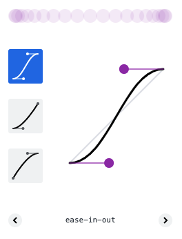

# Transition & Animation 

Les **transitions** et les **animations** CSS vous permettent de modifier les valeurs des propriétés dans le temps, créant visuellement de l'animation sur la page. 

Ce qui distingue les transitions des animations, en CSS, c'est que la **transition requiert une action**, un **déclencheur** — comme par exemple cliquer ou survoler un élément — alors que l'animation peut être permanente, comme par exemple une

Voici un exemple pour comprendre, avec les 2 approches : 

<iframe height="300" style="width: 100%;" scrolling="no" title="Untitled" src="https://codepen.io/l2lcn/embed/abLZgdV?default-tab=result" frameborder="no" loading="lazy" allowtransparency="true" allowfullscreen="true">
  See the Pen <a href="https://codepen.io/l2lcn/pen/abLZgdV">
  Untitled</a> by L2 LCN Écritures numériques (<a href="https://codepen.io/l2lcn">@l2lcn</a>)
  on <a href="https://codepen.io">CodePen</a>.
</iframe>

```html
<div class="flexbox">
  <div class="ma-transition">
    <span class="emoji">😈</span>
    transition
  </div>
  <div class="mon-animation">
    <span class="emoji">🙂</span>
    animation
  </div>
  <div class="mon-animation ma-transition">
    <span class="emoji">🤪</span>
    animation <br/>+ transition
  </div>
</div>
```

```css
/* transition */

.ma-transition{
  transition: 0.25s;
  background:#f0f0f0;
}
.ma-transition:hover{
  color: #ffffff;
  font-size:50px;
  background:#ff6600;
}
.ma-transition span{
  transition: 1s;
  display:block;
}
.ma-transition:hover span{
  transform:translate(0,-1em);
}

/* animation */
@keyframes tourne{
  0%{
    transform:rotate(0);
  }
  100%{
    transform:rotate(360deg);
  }
}
.mon-animation{
    background:#d0d0d0;
}
.mon-animation span{
  display:block;
  animation: tourne 2s infinite linear;
}

.mon-animation.ma-transition{
  background:#a9a9a9;
}

/* mise en page */
.flexbox{
  display:flex;
  width: 100vw;
  height: 100vh;
  align-items: center;
  justify-content: center;
  font-family: "Helvetica", sans-serif;
  cursor: default;
}
.emoji{
  text-align:center;
  font-size: 96px;
  line-height:1em;
  height:1em;
  padding:.1em;
}
.flexbox > div{
  text-align:center;
  font-size: 30px;
  padding: 1em;
}
```

# Propriétés

Les transitions et animations CSS peuvent s'appliquer à de nombreuses valeurs CSS : 

- les dimensions (exprimées en `px`,`%`,`em`, …)
  - largeur et hauteur d'un bloc (`width`, `height`)
  - marges (`padding`, `margin`, `border`)
  - la taille du texte (`font-size`,…)
  - les transformations spatiales (`transform`) avec les rotation, mise à l'échelle et déplacement (`rotate`,` scale`,` translate`)
- des couleurs 
  - du texte
  - d'arrière-plan
- l'opacité d'un élement : `opacity`

# Transitions

Pour qu'une transition s'applique **entre deux états** il suffit de mettre la propriété `transition` sur l'état de base, avec au minimum la durée de la transition, exprimé en **seconde** — l'unité est `s`. 

```css
/* la notation la plus simple */
.element{
  transition:1s;
  color: red;
}
.element:hover{
  color: blue;
}
```

Par défaut, une transition s'applique sur toutes les propriétés de l'élément, mais on peut choisir de ne cibler qu'une seul propriété. On peut aussi choisir que la transition aille plus vite dans un sens que dans l'autre. Enfin, on peut appliquer différentes durée — et donc vitesse, à différents éléments. 

Voici un exemple plus complexe, en spécifiant les propriétés par des virgules. 

```css
/* la notation la plus simple */
.element{
  transition:color 1s, font-size 2s; /* rapide au retour */
  color: red;
  font-size: 30px;
}
.element:hover{
  transition: color 0.5s, font-size 0.75s; /* lent à l'aller */
  color: blue;
  font-size: 60px;
}
```

<iframe height="300" style="width: 100%;" scrolling="no" title="Untitled" src="https://codepen.io/l2lcn/embed/LYzZwVo?default-tab=result" frameborder="no" loading="lazy" allowtransparency="true" allowfullscreen="true">
  See the Pen <a href="https://codepen.io/l2lcn/pen/LYzZwVo">
  Untitled</a> by L2 LCN Écritures numériques (<a href="https://codepen.io/l2lcn">@l2lcn</a>)
  on <a href="https://codepen.io">CodePen</a>.
</iframe>

On peut spécifier également la fonction de temporisation :  `timing-function`.

Cette propriété définit une fonction qui décrit la façon dont les valeurs intermédiaires sont calculées. la fonction par défaut ralentie en début et fin de transition, pour adoucir l'éffet : c'est le fondu d'entrée-sortie `ease-in-out`. La fonction la plus simple est la fonction linéaire `linear` — elle est plus abrupte.



```css
/* une autre manière d'écrire une transition, en détaillant toutes les propriétés */
.element {
  font-size: 14px;
  transition-property: font-size;
  transition-duration: 4s;
  transition-delay: 2s;
}

.element:hover {
  font-size: 36px;
}
```

## Animation

Une animation doit être défini par une directive `@keyframes` et un nom. Cette directive va détailler toutes les étapes d'une animation en pourcentage de la durée de l'animation. On appliquera ensuite celle-ci via la propriété `animation` en utisant une référence au nom choisi. Il faudra mettre à minima la durée du cycle et si on veut une boucle infinie, mettre `infinite` — car par défaut l'animation ne se joue une seule fois. 

```css
@keyframe clignotte{
  0%{
    opacity:1;
  }
  50%{
    opacity:0;
  }
  100%{
    opacity:1;
  }
}

.clignotte{
  animation: clignotte 1s infinite;
}
```

Les mêmes propriétés que pour les transitions peuvent être animées. 

<iframe height="300" style="width: 100%;" scrolling="no" title="feu !" src="https://codepen.io/l2lcn/embed/OJxXKbW?default-tab=css%2Cresult" frameborder="no" loading="lazy" allowtransparency="true" allowfullscreen="true">
  See the Pen <a href="https://codepen.io/l2lcn/pen/OJxXKbW">
  feu !</a> by L2 LCN Écritures numériques (<a href="https://codepen.io/l2lcn">@l2lcn</a>)
  on <a href="https://codepen.io">CodePen</a>.
</iframe>
